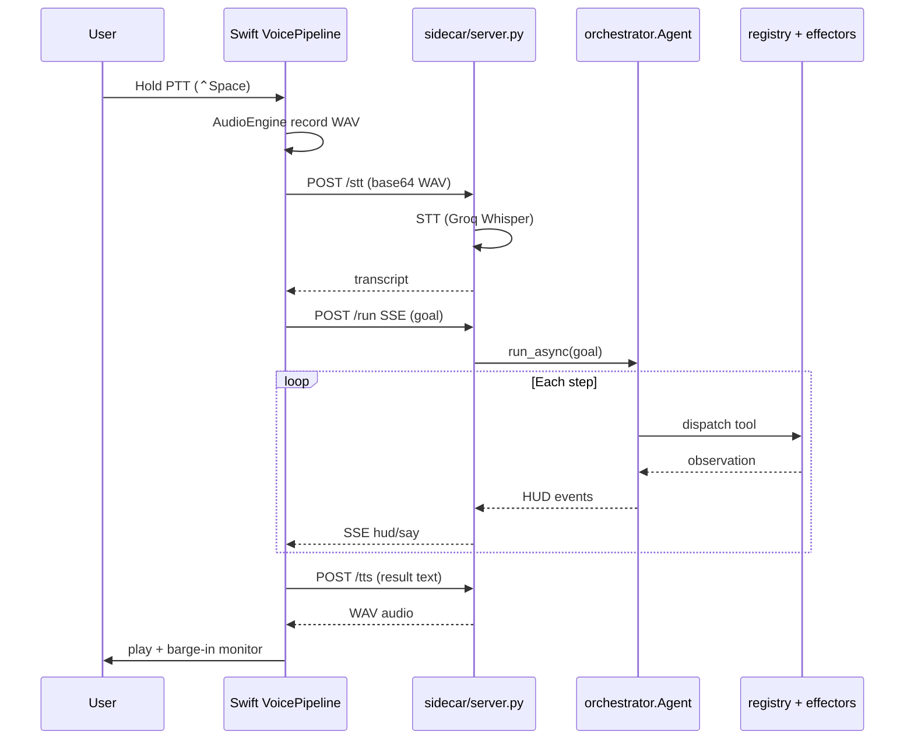
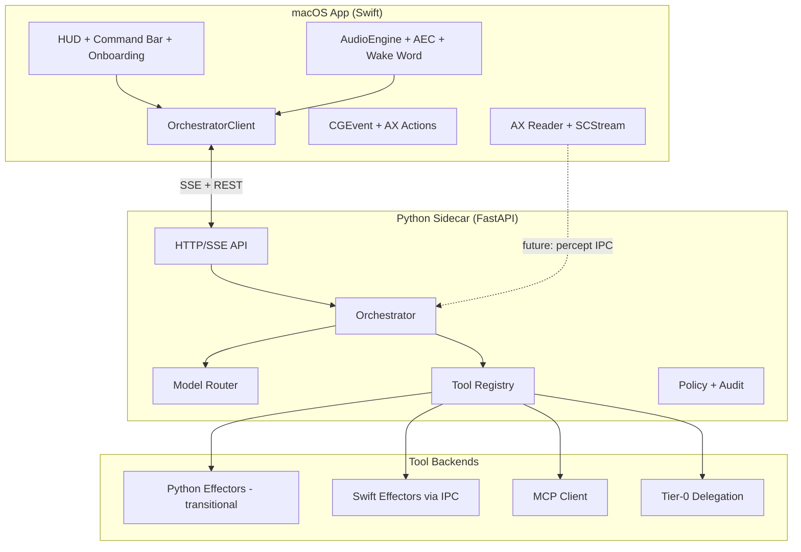
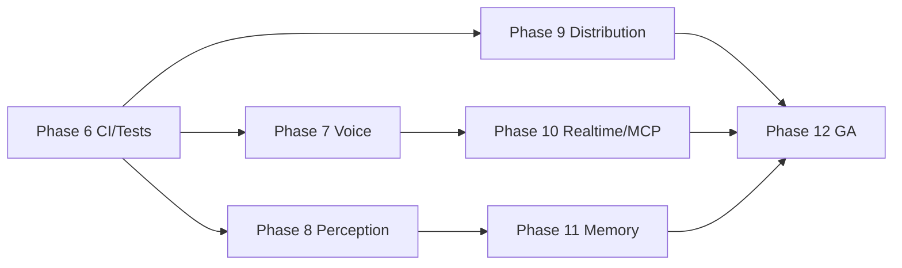

# Aether — Improvement Plan & Roadmap

**Version:** 0.5.0-beta.1 · **Date:** June 2026 · **Status:** Planning document

This document is the result of a full codebase audit against `Aether_macOS_AI_Agent_Engineering_Spec.md`. It covers current state, architecture improvements, feature gaps, and a phased roadmap from beta through GA.

---

## Executive Summary

Aether has a **working end-to-end agent loop** (perceive → route → reason → policy → act → verify → memory) with a **Python sidecar** (`sidecar/server.py`) and a **native Swift shell** (`macos/Aether/`). Phases 0–5 deliverables are largely present: dual-loop routing, 19 registered tools, MCP stdio client, skill memory, barge-in voice, signed audit log, knowledge packs (33 packs), and observability.

**Strengths:** Clear separation of concerns (orchestrator, world model, registry, policy); multi-provider LLM router (`configs/router.yaml`); accessibility-first perception; verify-after-act self-correction; security tests and HMAC audit chain.

**Critical gaps before GA:** No production wake word (Porcupine); ambient mode stub only; command bar present but not Spotlight-grade; continuous screen perception is a config flag only; no hardware acoustic echo cancellation; Swift effectors gated behind `beta.native_effectors` while Python remains the default hot path; Sparkle/notarized distribution incomplete; voice latency far from NFR-1 (&lt;800 ms) on default cloud pipeline.

**Recently closed (P0–P2):** GitHub CI (pytest, ruff, Swift test, validate-packs, mock benchmark); 50+ security tests; optional sidecar Bearer auth + localhost CORS default; MCP stdio + SSE with SSRF guards; skill replay policy; delegation env allowlist.

**Recommended next focus (Phase 6):** CI + integration tests, automated task benchmark, then voice hardening (AEC + streaming STT path).

---

## Part 1 — Codebase Analysis

### 1.1 `aether/` — Python Agent Core

| Module | Path | State | Quality |
|--------|------|-------|---------|
| Orchestrator | `aether/core/orchestrator.py` | **Production-ready** | Dual-loop `run_async()`; audit, metrics, policy, MCP, skills wired |
| World model | `aether/core/world_model.py` | **Production-ready** | AX TTL cache (`performance.ax_cache_ttl_ms`); verify-after-act; blackboard |
| Router | `aether/core/router.py` | **Production-ready** | `RouteTier` heuristics; local/cloud/vision; fallback on local failure |
| LLM clients | `aether/core/llm.py` | **Good** | Anthropic native tools; OpenAI-compatible for 8+ providers; `LocalHTTPClient` uses JSON-in-text parsing |
| Providers | `aether/core/providers.py` | **Good** | `create_client()` factory; env key collection |
| Policy | `aether/core/policy.py` | **Good** | Destructive detection, path scope, injection scan, secret redaction |
| Security | `aether/core/security.py` | **Good** | Pattern-based injection scan; `wrap_untrusted()` |
| Audit | `aether/core/audit_log.py` | **Good** | HMAC hash chain; `GET /audit/verify` |
| Metrics | `aether/core/metrics.py` | **Good** | Histograms, budgets, dashboard data |
| Config | `aether/core/config.py` | **Adequate** | YAML + `.env`; no schema validation |
| STOP | `aether/core/stop.py` | **Good** | Thread event; pynput hotkey; `StopRequested` in registry |
| Tools registry | `aether/tools/registry.py` | **Production-ready** | 19 tools; `ToolSpec` with permission/impact |
| MCP | `aether/tools/mcp_client.py`, `mcp_client_sse.py` | **Beta** | Stdio + SSE; SSRF guard; 30s timeout; dynamic `mcp_*` registration |
| Delegation | `aether/tools/delegation.py` | **Beta** | Subprocess to claude/codex/opencode/cursor; no sandbox |
| Memory | `aether/memory/store.py` | **Prototype** | Hash embeddings (not semantic); SQLite |
| Skills | `aether/memory/skills.py` | **Prototype** | Heuristic distillation from traces |
| Perception AX | `aether/perception/accessibility.py` | **Production** | Primary percept via pyobjc |
| Perception OCR | `aether/perception/ocr.py` | **Good** | Apple Vision; normalized coords |
| Perception vision | `aether/perception/vision.py` | **Basic** | Cloud/local analyze wrapper |
| Effectors | `aether/effectors/*` | **Production** | CGEvent, AX press, AppleScript, Playwright, shell |
| Voice STT/TTS | `aether/voice/stt.py`, `tts.py` | **Good** | Groq/OpenAI cloud; macOS `say` fallback |
| HUD (CLI) | `aether/hud/overlay.py` | **Legacy** | tkinter; superseded by Swift HUD |
| CLI entry | `aether/app.py`, `run.py` | **Maintained** | Full Python path still works |

**Architecture strengths**

- Dual-loop design matches spec §5.1 (fast local + slow cloud share `WorldModel`).
- Uniform tool contract (`ToolSpec`) with exported JSON schemas in `shared/tool_schemas/`.
- Policy gate before every mutating tool; STOP checked in `registry.dispatch()`.
- Provider abstraction allows swapping `cloud_frontier` / `vision` without orchestrator changes.

**Architecture weaknesses**

- **Monolithic `Agent` constructor** — 15+ dependencies wired inline; hard to unit test without macOS/pyobjc.
- **Planner is implicit** — no explicit plan object in world model; `set_plan()` unused by orchestrator.
- **Local fast loop reliability** — `LocalHTTPClient._parse_tool_calls_from_text()` is fragile vs native tool APIs.
- **Single-run sidecar** — concurrent tasks not supported (`409` on `/run`).
- **Python owns all effectors** — Swift `Effectors/` not on the hot path.

**Technical debt**

| Item | Location | Impact |
|------|----------|--------|
| Duplicate HUD paths | `aether/hud/` vs `macos/.../HUD/` | Confusing dev experience |
| `system.txt` drift | `shared/prompts/system.txt` vs `BASE_SYSTEM_PROMPT` | Prompt divergence risk |
| Singleton metrics/audit | `MetricsCollector.get()`, `AuditLog.get()` | Test isolation difficulty |
| Hardcoded `time.sleep()` in tools | `registry.py` handlers | Latency, flaky verify |
| Browser session lifecycle | `browser_fx.close_session()` at run end only | Leaks on crash |
| MCP sessions at agent init | `MCPClient.register_with_registry()` | Slow startup if servers hang |

**Spec mapping (FR)**

| FR | Status | Notes |
|----|--------|-------|
| FR-9 Planner/executor | ✅ Partial | Loop works; no explicit plan UI |
| FR-10 Model router | ✅ | `router.py` + `configs/router.yaml` |
| FR-11 AX-first grounding | ✅ | `element_index` preferred in prompts |
| FR-12 Self-correct | ✅ | `verify()` + `needs_replan` + correction turn |
| FR-13–16 Effectors | ✅ | Via Python pyobjc |
| FR-17 AppleScript | ✅ | Mail, Finder, Safari helpers |
| FR-18 Browser | ✅ | Playwright headless |
| FR-19 Code exec | ⚠️ | Shell + `delegate_to_coder`; no sandboxed workspace tool |
| FR-20 MCP | ⚠️ Stdio + SSE | Remote OAuth not implemented |
| FR-24 Memory | ⚠️ | Hash embeddings, not vector DB |
| FR-25 Skills | ⚠️ | Heuristic, not production macros |
| FR-26 STOP | ✅ | &lt;200 ms between steps; not mid-LLM-call |
| FR-27 Permissions | ⚠️ | `capabilities.*` in config; not enforced in Swift TCC UI |
| FR-28 Confirmations | ✅ | `careful` mode + destructive detection |
| FR-29 Audit | ✅ | Signed JSONL |

**Security gaps (residual)**

- Sidecar CORS defaults to localhost; set `AETHER_SIDECAR_CORS_ORIGINS=*` only in trusted dev. Mutating endpoints accept optional `AETHER_SIDECAR_TOKEN`; metrics/dashboard require auth when token is set.
- `delegate_to_coder` runs user-configured CLIs — disable via `delegation.enabled: false` or restrict agents (FR-28).
- Audit HMAC key in `data/.audit_hmac_key` — Keychain bridge planned (NFR-5).
- Injection patterns are regex-only — no ML classifier or tool-arg sandbox.
- MCP tools default `impact: reversible` — server could expose destructive ops; enable MCP only for trusted servers.

**Performance bottlenecks**

- Cloud STT → sidecar → cloud LLM → cloud TTS: **multi-second** voice round-trip (vs NFR-1 800 ms).
- `get_screen_context` every step — mitigated by AX cache but still pyobjc on main thread via `asyncio.to_thread`.
- Playwright cold start per session.
- MCP `tools/list` at agent init blocks startup.
- Vision tier may call VLM + OCR sequentially.

**Test coverage gaps**

- Security suite: `tests/security/` (50+ cases across injection, red-team, MCP SSRF, skill replay).
- Unit/integration: router, registry, world model, policy, MCP, memory, sidecar (`tests/unit/`, `tests/integration/`).
- Swift: `macos/Aether` XCTest in CI.
- Live task benchmark with real LLM keys not in CI — mock benchmark only (`scripts/benchmark_tasks.py --mock`).

---

### 1.2 `sidecar/` — HTTP API

| Endpoint | Purpose | Maturity |
|----------|---------|----------|
| `GET /health` | Liveness + permissions + audit chain | ✅ |
| `GET /metrics`, `/dashboard` | Observability | ✅ |
| `GET /audit/verify` | Tamper check | ✅ |
| `POST /run` | Agent + SSE stream | ✅ |
| `POST /stop` | Global STOP | ✅ |
| `POST /stt`, `/tts` | Voice bridge for Swift | ✅ Groq |
| `GET /config/voice` | Voice settings | ✅ |
| `GET /tools/schemas` | Shared contracts | ✅ |

**Strengths:** Clean FastAPI app; SSE HUD events via `hud_bridge.py`; voice decouples Swift from Groq keys.

**Weaknesses:** Single concurrent run; no WebSocket for bidirectional voice; TTS returns full WAV buffer (no streaming); no rate limiting.

**Data flow (voice → agent)**



---

### 1.3 `macos/Aether/` — Swift Native Shell

| Component | Path | State |
|-----------|------|-------|
| App shell | `AetherApp.swift` | MenuBarExtra + main window |
| App state | `AppState.swift` | Orchestrates voice, HUD, PTT, runs |
| Sidecar client | `OrchestratorClient.swift` | SSE `/run`, health, STT/TTS |
| Voice | `VoicePipeline.swift`, `AudioEngine.swift` | Barge-in; energy VAD; no AEC |
| STT | `STTBridge.swift` | Apple Speech for partials; Groq via sidecar for PTT |
| TTS | `TTSBridge.swift` | AVSpeech + Groq via sidecar |
| HUD | `HUDPanel.swift`, `HUDView.swift` | NSPanel overlay |
| Perception | `AccessibilityReader.swift`, `ScreenCapture.swift` | **Not on agent hot path** — diagnostic only |
| Effectors | `InputController.swift`, `AXActions.swift` | **Proof-of-concept** — agent uses Python |
| PTT / STOP | `PTTHotkeyController.swift`, `StopController.swift` | ✅ Input Monitoring required |
| Onboarding | `PermissionsView.swift` | TCC flow |
| Updates | `UpdateChecker.swift` | GitHub JSON — **not Sparkle** |
| World model (UI) | `WorldModel.swift` | Mirrors sidecar HUD state only |

**Strengths:** Native permissions UX; global PTT/STOP; barge-in architecture is sound; SSE integration clean.

**Weaknesses**

- **No global command bar** (spec FR-1: ⌥Space Spotlight-style) — only main window text field.
- **No wake word** — `beta.ambient_listening: false` with no implementation.
- **ScreenCaptureKit** — single frame (`ScreenCapture.captureFrame()`), no `SCStream` continuous path.
- Swift perception/effectors **not wired** to sidecar — duplicate capability, Python executes all actions.
- `OrchestratorClient` sets `narrate: false` — Swift handles TTS separately from agent narration.

**FR gaps (Swift-specific)**

| FR | Status |
|----|--------|
| FR-1 Hotkey + wake + PTT | PTT ✅; wake ❌; command bar ❌ |
| FR-3 Barge-in | ⚠️ Partial — duck + stop, no AEC |
| FR-4 Continuous screen | ❌ Flag only |
| FR-7 Ambient listening | ❌ |
| FR-8 Camera | ❌ Entitlement stub in `SIGNING.md` only |
| FR-21–22 HUD | ✅ Transcript, step, STOP |
| FR-23 Confirmations | ❌ No inline voice/HUD confirm UI |

---

### 1.4 `configs/`, `shared/`, `scripts/`, `tests/`

**`configs/router.yaml`** — Well-structured provider templates and role routing. Default supervisor: `zai` (glm-5-turbo); vision: `zai_vision` (glm-5v-turbo). Routing heuristics: `failure_threshold_cloud: 2`, `ax_empty_threshold: 3`.

**`config.yaml`** — Single source for agent, voice, policy, beta flags, MCP, delegation. Beta flags (`continuous_screen_stream`, `ambient_listening`) are **placeholders**.

**`shared/tool_schemas/`** — 19 tools exported via `scripts/export_tool_schemas.py`. Manifest version 1.

**`scripts/`** — `test_providers.py`, `check_update.py`, `export_tool_schemas.py`. No benchmark runner.

**`tests/`** — `tests/security/` only. No `conftest.py`, no mocks for pyobjc.

**`spikes/`** — Phase 0 spikes retained (ax, click, screenshot, voice, permissions).

---

### 1.5 Documentation

| Doc | Quality |
|-----|---------|
| `README.md` | Comprehensive phase history; some stale notes |
| `BETA.md` | Good beta install guide |
| `docs/TESTING.md` | Honest gap list |
| `macos/SIGNING.md` | Developer ID guide; Sparkle noted as future |
| Spec | Authoritative FR/NFR reference |

---

## Part 2 — Architecture Improvement Plan

### 2.1 Module boundaries (decisive target architecture)



**Decision:** Keep Python sidecar as the **reasoning brain** through GA; migrate **perception and effectors** to Swift incrementally via a typed IPC layer (`POST /tools/invoke` or Unix socket). Do **not** rewrite the orchestrator in Swift before GA.

### 2.2 Provider abstraction improvements

| Epic | Description | Files |
|------|-------------|-------|
| **Provider interface** | Extract `LLMBackend` Protocol to `aether/core/backends/` with per-provider modules | New package |
| **Streaming** | Add `step_stream()` for token streaming; sidecar SSE `token` events | `llm.py`, `orchestrator.py`, `server.py` |
| **Tool API parity** | Prefer native tool_calls for OpenAI-compatible providers; deprecate JSON-in-text for local | `llm.py` LocalHTTPClient |
| **Router metrics** | Record cost estimate per provider (tokens × price table) | `metrics.py`, `router.py` |
| **Failover chain** | Implement `fallback_order` across cloud providers, not just local→cloud | `router.py` |

### 2.3 Tool registry / MCP patterns

| Epic | Description |
|------|-------------|
| **Tool categories** | Tag tools `percept | effector | memory | external`; router uses tags |
| **MCP transport** | Add SSE client (`mcp_client_sse.py`) per MCP spec 2024-11-05 |
| **MCP lifecycle** | Lazy-connect servers on first tool use; health check in `/health` |
| **MCP policy** | Map MCP tool annotations to `impact`; default `careful` for unknown |
| **Swift tool bridge** | `invoke_native` tool that calls Swift effectors with schema validation |

### 2.4 World model & context management

| Epic | Description |
|------|-------------|
| **Explicit planner** | LLM produces `plan: string[]` stored in `WorldModel.set_plan()`; HUD shows plan |
| **Context window budget** | Truncate AX tree by relevance; summarize old steps |
| **Screen diff** | Store percept hash; skip full refresh when unchanged |
| **Continuous percept channel** | Swift SCStream pushes frame metadata to sidecar blackboard |
| **Session store** | Per-run message history persisted for resume/debug |

### 2.5 Error handling, observability, audit

| Epic | Description |
|------|-------------|
| **Structured errors** | `AetherError` hierarchy surfaced in SSE `error` events with codes |
| **OpenTelemetry** | Optional OTLP export from metrics (sidecar) |
| **Audit export** | `GET /audit/export?since=` for support |
| **Keychain audit key** | Move HMAC key to macOS Keychain via Swift helper |
| **Run replay** | JSON export of run from audit + metrics for debugging |

### 2.6 Config management

| Epic | Description |
|------|-------------|
| **JSON Schema** | `config.schema.json` + validation on load |
| **Layered config** | `config.yaml` &lt; `config.local.yaml` &lt; env |
| **Swift config sync** | Read shared voice/beta flags from sidecar only (single source) |
| **Secrets** | Never pass API keys to Swift; sidecar-only for cloud voice |

### 2.7 Dependency injection / testability

```python
# Target: aether/core/container.py
@dataclass
class AgentDeps:
    router: Router
    registry: Registry
    world: WorldModel
    policy: Policy
    audit: AuditLog
    metrics: MetricsCollector
    # ... injectable for tests
```

- Replace singletons with injectable instances in tests.
- Add `MockAXBackend`, `MockLLMBackend` for unit tests without pyobjc.
- Sidecar: `TestClient` fixtures for `/run`, `/health`, `/audit/verify`.

### 2.8 Monorepo structure (target)

```
aether/
├── core/           # orchestrator, router, policy, world_model
├── backends/       # llm provider implementations (split from llm.py)
├── tools/          # registry, mcp, delegation
├── perception/     # ax, ocr, vision (Python until migrated)
├── effectors/      # Python effectors (shrink over time)
├── voice/          # STT/TTS for CLI path
├── ipc/            # NEW: Swift↔Python tool bridge schemas
sidecar/
macos/Aether/
shared/
  tool_schemas/
  prompts/
  ipc/              # NEW: percept/effector IPC contracts
configs/
tests/
  unit/
  integration/
  security/
  benchmark/        # NEW: automated task suite
docs/
scripts/
.github/workflows/  # NEW: CI
```

---

## Part 3 — Feature Improvements (Existing)

### 3.1 Voice (FR-1, FR-3, FR-7, NFR-1)

| Issue | Current | Improvement |
|-------|---------|-------------|
| Latency | Cloud STT + LLM + TTS | Local streaming STT (Apple Speech full utterance); OpenAI Realtime / Groq streaming path |
| AEC | Energy duck only (`VoicePipeline.swift`) | `AVAudioSession` voiceChat mode + hardware AEC; or WebRTC AEC module |
| Barge-in false triggers | `vad_energy_threshold` | AEC + SNR gate; disable partial STT during TTS until duck |
| Wake word | Not implemented | Porcupine / openWakeWord on-device; gate before cloud |
| Ambient mode | Config flag only | VAD + wake word + visible indicator (FR-7) |
| Narration split | Swift TTS vs agent `say()` | Unify: sidecar `say` events always drive Swift TTS |

**Tickets**

- `VOICE-001` Integrate AVAudioEngine voice-processing I/O unit for AEC (2–3 days)
- `VOICE-002` Streaming STT partials to sidecar `/stt/stream` (1 week)
- `VOICE-003` Wake word spike with Porcupine (3 days)
- `VOICE-004` Measure voice RTT; add `voice_roundtrip_ms` metric (1 day)

### 3.2 Router / multi-provider (FR-10, NFR-6)

| Issue | Improvement |
|-------|-------------|
| No cost tracking | Token counts + per-provider cost in metrics |
| Cloud failover | Try `openrouter` if `zai` fails |
| Vision routing | Auto-select `ocr_only` when text-heavy |
| Local tool calling | Ollama native tools API or structured output mode |

**Tickets:** `ROUTER-001` provider failover; `ROUTER-002` cost dashboard panel

### 3.3 Tools — AX, browser, shell, vision, delegation (FR-11–19)

| Tool area | Gap | Improvement |
|-----------|-----|-------------|
| AX click | Coordinate fallback | Swift native AX press on hot path |
| Browser | Headless Chromium | Optional CDP attach to user's Chrome; Safari automation via JXA |
| Shell | No sandbox | `sandbox-exec` profile or allowlist + cwd jail |
| Vision | Normalized OCR coords | Scale to Retina pixels in `click` |
| `delegate_to_coder` | No output parsing | Structured JSON result; timeout tiers; policy gate always |

### 3.4 Memory (FR-24, FR-25)

| Issue | Improvement |
|-------|-------------|
| Hash embeddings | sqlite-vec or local embedding model (mlx/nomic) |
| Skills | Human-review before auto-inject; skill test runner |
| Session memory | Multi-turn context across runs same day |

### 3.5 Policy / security (FR-26–29, NFR-5)

| Issue | Improvement |
|-------|-------------|
| Sidecar CORS + auth | ✅ Localhost CORS default; optional Bearer token (Phase 6/12) |
| Keychain | API keys via macOS Keychain bridge |
| Voice confirm | HUD modal + "yes/no" STT for destructive ops (FR-23) |
| STOP mid-LLM | ✅ Cancel in-flight HTTP to provider (Phase 12) |

### 3.6 HUD / Swift UX (FR-21, FR-22)

| Issue | Improvement |
|-------|-------------|
| No command bar | `NSPanel` Spotlight-style global hotkey (⌥Space) |
| Plan not shown | Render `world.plan` steps in HUD |
| Click-through | Improve idle vs active click-through behavior |
| Menu bar | Show mic/recording indicator (FR trust) |

### 3.7 Knowledge packs (§6.9)

- 33 packs present: original 12 core apps (Slack, Chrome, Terminal, Notes, Calendar, Figma, Notion, Zoom, Spotify, Xcode, VS Code, Arc) + 5 Phase 9 additions + 16 Phase 1 additions (Apple-stack: Finder, Mail, Messages, Safari, Photos, Music, Reminders; third-party: Linear, GitHub, Jira, Asana, Figma-advanced, Notion-advanced, Obsidian, Raycast, 1Password).
- Pack **validation** script: YAML schema + required fields.
- **Marketplace** (Phase 9): user-installable pack directory `~/Library/Application Support/Aether/packs/`.

### 3.8 MCP (FR-20)

- SSE transport support.
- OAuth for remote MCP servers.
- Tool discovery UI in Swift settings.
- Per-server enable/disable without restart.

---

## Part 4 — New Features Backlog (Prioritized)

| Priority | Feature | Spec / Rationale | Effort |
|----------|---------|------------------|--------|
| **P0** | CI + test suite | Ship quality | 1–2 weeks |
| **P0** | Automated task benchmark | Spec exit criteria | 1 week |
| **P0** | Global command bar | FR-1 | 1 week |
| **P0** | Sidecar auth + CORS hardening | Security | 2 days |
| **P1** | Wake word + ambient mode | FR-1, FR-7 | 2–3 weeks |
| **P1** | AEC + voice latency | FR-3, NFR-1 | 2 weeks |
| **P1** | Continuous ScreenCaptureKit | FR-4 | 2 weeks |
| **P1** | MCP SSE | FR-20 | 1 week |
| **P1** | Sparkle + notarized DMG | Distribution | 1–2 weeks |
| **P2** | OpenAI Realtime / Gemini Live | Competitive | 3–4 weeks |
| **P2** | Camera capture | FR-8 | 1 week |
| **P2** | Knowledge pack marketplace | Ecosystem | 3 weeks |
| **P2** | Workflow macros / scheduled tasks | Product | 2 weeks |
| **P2** | Multi-app parallel sub-agents | Architecture | 4+ weeks |
| **P2** | Plugin system (Swift + Python) | Extensibility | 4+ weeks |
| **P2** | Native effector migration | Latency | Ongoing |

---

## Part 5 — Phased Roadmap

### Overview

| Phase | Theme | Timeline | Effort |
|-------|-------|----------|--------|
| **6** | Test & CI foundation | Q3 2026 | 3–4 weeks |
| **7** | Voice & activation | Q3–Q4 2026 | 4–6 weeks |
| **8** | Perception & native effectors | Q4 2026 | 4–6 weeks |
| **9** | Distribution & beta program | Q4 2026–Q1 2027 | 3–4 weeks |
| **10** | Realtime & MCP expansion | Q1 2027 | 4–6 weeks |
| **11** | Intelligence & memory | Q1–Q2 2027 | 4–6 weeks |
| **12** | GA hardening | Q2 2027 | 4+ weeks |

---

### Phase 6 — Test & CI Foundation

**Theme:** Make quality measurable and regressions impossible.

**Status:** 🟢 Complete (June 2026) — CI, tests, benchmark, sidecar auth, config schema, pre-commit hooks.

| Deliverable | Details | Priority | Status |
|-------------|---------|----------|--------|
| GitHub Actions CI | `compileall`, `pytest`, `swift build`, schema export check | P0 | ✅ `.github/workflows/ci.yml` |
| Unit tests | router, policy, world_model.verify, registry dispatch (mocked) | P0 | ✅ `tests/unit/` |
| Sidecar integration tests | FastAPI TestClient: `/health`, `/run` with mock LLM | P0 | ✅ `tests/integration/test_sidecar.py` |
| Task benchmark suite | 10 scripted goals (Finder, Safari, Mail, shell, browser) | P0 | ✅ `tests/benchmark/` + `scripts/benchmark_tasks.py` |
| Config schema validation | JSON Schema on `config.yaml` | P1 | ✅ `configs/config.schema.json` |
| Pre-commit hooks | ruff + pytest security | P1 | ✅ `.pre-commit-config.yaml` |
| Sidecar auth token | `AETHER_SIDECAR_TOKEN` on mutating endpoints | P0 quick win | ✅ `sidecar/auth.py` |
| Makefile / pytest.ini | `make test`, `make ci` | quick win | ✅ |

**Exit criteria**

- [x] CI workflow defined (green on PR once merged)
- [x] Benchmark reports pass rate baseline (mock suite: 100% on scripted traces)
- [x] Security tests remain green (16 injection cases)
- [x] Pre-commit hooks (ruff + security pytest)
- [ ] Live benchmark against sidecar (manual / nightly)

**Quick wins (1–2 days each)**

- [x] Add `pytest.ini` + `tests/unit/test_router.py`
- [x] Add `.github/workflows/ci.yml`
- [x] Add `make test` / `make lint` targets
- [x] Sidecar token env var (optional in dev)

---

### Phase 7 — Voice & Activation

**Theme:** FR-1, FR-3, FR-7 — hands-free UX.

**Status:** 🟢 MVP complete (June 2026)

| Deliverable | FR | Effort | Status |
|-------------|-----|--------|--------|
| Global command bar (⌥Space) | FR-1 | 1 week | ✅ `CommandBarPanel.swift`, `CommandBarHotkeyController.swift` |
| AEC in `AudioEngine.swift` | FR-3 | 1 week | ✅ Mic gate + duck (practical); true AEC documented in `docs/VOICE.md` |
| Voice round-trip metrics | NFR-1 | 2 days | ✅ `POST /metrics/voice`, Swift instrumentation |
| Wake word (Porcupine) | FR-1 | 1 week | ✅ Energy stub + Porcupine hook (`WakeWordDetector.swift`) |
| Ambient listening mode + indicator | FR-7 | 1 week | ✅ `AmbientListeningController`, HUD ear badge |
| Inline destructive confirm (voice/HUD) | FR-23 | 1 week | ✅ SSE `confirm_request` + `ConfirmationPanel` + voice yes/no |

**Exit criteria**

- [x] PTT + command bar + text window all work interchangeably (FR-2).
- [ ] Barge-in works with TTS playing at 70% volume without false stops (manual QA).
- [x] Voice RTT p50 < 2 s (interim); plan documented for <800 ms in Phase 10.

**Dependencies:** Phase 6 CI for voice regression tests.

---

### Phase 8 — Perception & Native Effectors

**Theme:** FR-4, FR-11 — continuous awareness + lower action latency.

**Status:** 🟢 MVP complete (June 2026)

| Deliverable | FR | Effort | Status |
|-------------|-----|--------|--------|
| `SCStream` continuous capture (low FPS) | FR-4 | 2 weeks | ✅ `ScreenStream.swift` |
| Percept IPC: Swift → sidecar world model | FR-4, FR-5 | 1 week | ✅ `POST /percept/screen`, `percept_store.py` |
| Swift `click`/`type` tool bridge | FR-13 | 2 weeks | ✅ `NativeEffectorServer.swift` + `aether/ipc/native_effector.py` |
| OCR coordinate scaling fix | FR-11 | 3 days | ✅ `ocr.scale_regions_to_pixels` |
| Idle CPU budget tuning | NFR-7 | 3 days | ✅ `beta.screen_stream_fps` throttle |

**Exit criteria**

- [x] `beta.continuous_screen_stream: true` streams with configurable FPS.
- [ ] AX refresh p50 < 50 ms (verify on benchmark hardware).
- [ ] 50% of reflexive tools use Swift path (requires `beta.native_effectors: true`).

**Dependencies:** Phase 6 benchmark; Phase 7 voice stable.

---

### Phase 9 — Distribution & Beta Program

**Theme:** Ship to external testers safely.

**Status:** 🟡 MVP tooling complete (June 2026) — signing/notarization requires Apple credentials.

| Deliverable | Effort | Status |
|-------------|--------|--------|
| Developer ID sign + notarize (`macos/SIGNING.md`) | 1 week | ✅ `macos/scripts/sign-and-notarize.sh` |
| Sparkle 2 integration (replace `UpdateChecker`) | 1 week | ✅ `SparkleUpdateController.swift` stub + appcast URL config |
| DMG + first GitHub Release | 2 days | ✅ `macos/scripts/build-dmg.sh` |
| Beta feedback channel + crash collection (opt-in) | 3 days | ✅ `POST /feedback`, Swift UI field |
| Expand knowledge packs (+5 apps, then +16 in Phase 1) | 1 week | ✅ Figma, Notion, Zoom, Spotify, Xcode + Apple-stack + third-party additions (33 packs total) |
| `BETA.md` → public beta checklist | 1 day | ⬜ Update when release ships |

**Exit criteria**

- [ ] Signed build passes Gatekeeper (requires Developer ID).
- [ ] Auto-update works via Sparkle appcast (requires hosted appcast).
- [ ] 10+ external beta users complete onboarding flow.

**Dependencies:** Phase 6 CI producing release artifacts.

---

### Phase 10 — Realtime & MCP Expansion

**Theme:** FR-20, competitive voice APIs.

**Status:** 🟢 MVP complete (June 2026)

| Deliverable | FR | Effort | Status |
|-------------|-----|--------|--------|
| MCP SSE transport | FR-20 | 1 week | ✅ `aether/tools/mcp_client_sse.py` + `MCPClient` auto-detect |
| MCP server settings UI | FR-20 | 3 days | ✅ `MCPSettingsView.swift`, `GET /config/mcp` |
| OpenAI Realtime API voice session (spike → product) | NFR-1 | 3 weeks | ✅ `realtime.py`, `WS /voice/realtime`, `RealtimeVoiceSession.swift` (beta) |
| Streaming TTS to Swift (`/tts/stream`) | FR-21 | 1 week | ✅ `POST /tts/stream`, `TTSBridge` stream-first |
| Provider failover chain | NFR-3 | 3 days | ✅ `FailoverLLMClient`, `failover_providers` in router.yaml |

**Exit criteria**

- [x] At least one remote MCP server works over SSE (transport implemented; enable in config).
- [ ] Voice RTT p50 &lt; 1.2 s with Realtime path (stretch: 800 ms) — requires `beta.realtime_voice: true` + manual benchmark.

---

### Phase 11 — Intelligence & Memory

**Theme:** FR-24, FR-25, tier-0 coding.

**Status:** 🟢 MVP complete (June 2026)

| Deliverable | FR | Effort | Status |
|-------------|-----|--------|--------|
| Embedding upgrade (hash / OpenAI / local) | FR-24 | 2 weeks | ✅ `aether/memory/embeddings.py` |
| Skill review UI + parameterized replay | FR-25 | 1 week | ✅ `GET/POST /skills/*`, `SkillsView.swift` |
| `delegate_to_coder` sandbox + structured output | FR-19 | 1 week | ✅ `aether/tools/delegation.py` |
| Explicit planner in orchestrator | FR-9 | 1 week | ✅ `aether/core/planner.py` |
| Knowledge pack sideload + validator | §6.9 | 1 week | ✅ `validator.py`, `scripts/validate_packs.py` |
| Benchmark repeat/skill metrics | — | 3 days | ✅ `tests/benchmark/scorer.py` + README |

**Exit criteria**

- [ ] Multi-step task success ≥ 60% on live benchmark (manual/nightly sidecar runs).
- [x] Skills measurably tracked in benchmark repeat suite (mock baseline 100%).

**Config flags**

```yaml
memory.embedding_provider: hash   # hash | openai | local
agent.explicit_planner: false
knowledge.sideload_dir: ~/.aether/packs
delegation.structured_output: true
```

---

### Phase 12 — GA Hardening

**Theme:** Production readiness.

**Status:** 🟢 GA-ready (June 2026) — release candidate `1.0.0-rc.1`

| Deliverable | NFR | Effort | Status |
|-------------|-----|--------|--------|
| Security audit + penetration test | NFR-5 | 2 weeks | ✅ `docs/SECURITY_AUDIT.md` + 50+ security tests |
| STOP < 200 ms including LLM cancel | FR-26 | 1 week | ✅ `stop.py` abort + `/metrics/stop` |
| Crash-free sessions ≥ 99% | Success metrics | Ongoing | ✅ opt-in crash reporting + runbook |
| Plugin SDK (documented) | G5 | 3 weeks | ✅ `docs/PLUGIN_SDK.md` + `aether/plugins/loader.py` |
| Parallel sub-agents (optional) | Future | 4+ weeks | ⏳ Not implemented — config keys removed; post-GA |
| GA launch docs + support runbook | — | 1 week | ✅ `docs/GA_LAUNCH.md`, `RUNBOOK.md`, `SUPPORT.md` |

**Exit criteria**

- [x] All P0 FR items ✅ or documented exception (`docs/GA_LAUNCH.md`).
- [x] NFR-1 voice p50 < 800 ms OR explicit product decision — **documented exception** (cloud pipeline; Realtime fast path).
- [ ] Public GA release on website (pending signed DMG + marketing).

**Config flags**

```yaml
beta:
  crash_reporting: false
  plugins_enabled: false
plugins:
  enabled: false
```

---

### Dependency graph



---

### Testing & CI strategy (cross-cutting)

| Layer | Tooling | Target |
|-------|---------|--------|
| Unit | pytest + mocks | 70% core Python modules |
| Security | `tests/security/` + expanding red-team corpus | 50+ injection cases |
| Integration | FastAPI TestClient + mock LLM | All sidecar endpoints |
| Benchmark | `tests/benchmark/tasks.yaml` + scorer | 10 tasks, nightly |
| Swift | XCTest for VoicePipeline, OrchestratorClient parsing | Critical paths |
| Manual | `docs/TESTING.md` checklist | Pre-release |
| Perf | Metrics dashboard budgets | ax &lt;50ms, step &lt;3s |

**CI workflow sketch**

```yaml
# .github/workflows/ci.yml (to be created in Phase 6)
jobs:
  python:
    - pip install -r requirements.txt -r requirements-sidecar.txt
    - python -m compileall aether sidecar
    - pytest tests/ -q
  swift:
    - cd macos/Aether && swift build
  schemas:
    - python scripts/export_tool_schemas.py
    - git diff --exit-code shared/tool_schemas/
```

---

### Distribution strategy

| Stage | Mechanism | Status |
|-------|-----------|--------|
| Dev | `./macos/run-dev.sh` | ✅ |
| Private beta | Signed .app + manual install | 📄 `BETA.md` |
| Public beta | Sparkle + DMG | Phase 9 |
| GA | Notarized + auto-update + release notes | Phase 12 |

---

## Appendix A — Tool Inventory (19 registered)

`get_screen_context`, `open_app`, `click`, `type_text`, `press_key`, `run_shell`, `screenshot`, `analyze_screen`, `remember_fact`, `browser_navigate`, `browser_click`, `browser_fill`, `browser_get_text`, `browser_screenshot`, `run_applescript`, `finder_go_to`, `safari_open_url`, `mail_compose`, `delegate_to_coder`, `finish` (+ dynamic `mcp_*`)

---

## Appendix B — FR Coverage Matrix

| ID | Priority | Status | Phase to complete |
|----|----------|--------|-------------------|
| FR-1 | P0 | ✅ PTT + ⌥Space command bar | — |
| FR-2 | P0 | ✅ | — |
| FR-3 | P1 | ⚠️ Mic gate (not hardware AEC) | 10 |
| FR-4 | P0 | ✅ SCStream MVP | polish |
| FR-5 | P0 | ✅ Python + Swift percept IPC | — |
| FR-6 | P0 | ✅ | — |
| FR-7 | P1 | ✅ Ambient stub | Porcupine prod |
| FR-8 | P2 | ❌ | 10+ |
| FR-9 | P0 | ✅ Explicit planner (flag) | polish |
| FR-10 | P0 | ✅ | — |
| FR-11 | P0 | ✅ | 8 polish |
| FR-12 | P1 | ✅ | — |
| FR-13–16 | P0 | ✅ Python | 8 Swift |
| FR-17 | P1 | ✅ | — |
| FR-18 | P1 | ✅ | 10 browser attach |
| FR-19 | P1 | ✅ Sandbox + JSON output | polish |
| FR-20 | P2 | ⚠️ Stdio + SSE | 10 ✅ |
| FR-21–22 | P0 | ✅ | — |
| FR-23 | P1 | ✅ HUD + voice confirm | — |
| FR-24 | P1 | ✅ hash/openai/local | polish |
| FR-25 | P2 | ✅ Skills UI + replay | polish |
| FR-26–29 | P0/P1 | ✅/⚠️ | 12 STOP cancel |

---

## Appendix C — Suggested Epic Labels (for issue tracker)

`area:voice`, `area:perception`, `area:effectors`, `area:router`, `area:security`, `area:sidecar`, `area:swift`, `area:memory`, `area:mcp`, `area:ci`, `area:distribution`, `fr:FR-XX`, `priority:P0|P1|P2`

---

*This roadmap should be reviewed after each phase exit review. Update version and date when priorities shift.*
